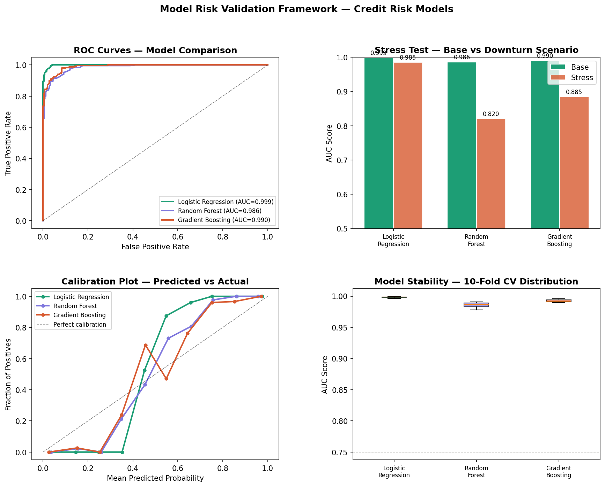

# Model Risk Validation Framework

A quantitative model risk validation pipeline that stress tests, 
compares, and validates three competing credit risk models — 
following the principles of **SR 11-7**, the Federal Reserve's 
guidance on model risk management used by banks globally.

## Output


## Why this matters
Every AI/ML model used in banking must be independently validated 
before deployment. Model Risk Management (MRM) teams run exactly 
these tests to ensure models are stable, well-calibrated, and 
robust under adverse conditions. This is one of the fastest growing 
functions in risk as AI adoption in banking accelerates.

## Models validated
| Model | Type | Use case |
|---|---|---|
| Logistic Regression | Linear | Industry baseline, fully interpretable |
| Random Forest | Ensemble | Non-linear relationships, feature importance |
| Gradient Boosting | Ensemble | High performance, production-grade |

## Validation tests performed

### ① Stability Test — K-Fold Cross Validation
10-fold CV across the full dataset. Flags models with AUC standard 
deviation > 0.03 as unstable. Unstable models fail SR 11-7 
conceptual soundness requirements.

### ② Population Stability Index (PSI)
Measures whether the score distribution has shifted between 
training and test populations.
| PSI | Interpretation |
|---|---|
| < 0.10 | Stable — no action needed |
| 0.10 – 0.20 | Moderate drift — monitor |
| > 0.20 | High drift — model redevelopment required |

### ③ Stress Test — Economic Downturn Scenario
Simulates a macroeconomic shock:
- Credit scores reduced by 15%
- Debt-to-income ratios increased by 40%
- Missed payments increased by 2
- Employment years reduced by 30%

Models with AUC degradation > 0.05 are flagged as fragile.

### ④ Gini Coefficient — Discriminatory Power
Gini = 2 × AUC − 1. Industry standard for credit model performance.
| Gini | Rating |
|---|---|
| > 0.60 | Strong |
| 0.40 – 0.60 | Moderate |
| < 0.40 | Weak — not fit for purpose |

## Output chart panels
1. **ROC Curves** — side-by-side AUC comparison across all 3 models
2. **Stress Test** — base vs downturn AUC for each model
3. **Calibration Plot** — predicted probability vs actual default rate
4. **Stability Boxplot** — 10-fold CV AUC distribution per model

## Regulatory context
This framework mirrors the validation requirements under:
- **SR 11-7** (Federal Reserve model risk guidance)
- **SS1/23** (Bank of England model risk management)
- **Basel III** internal ratings-based approach validation

## How to run
```bash
pip install pandas numpy matplotlib scikit-learn scipy
python3 model_risk_validator.py
```

## What I'd improve next
- Add SHAP explainability for each model
- Include CSI (Characteristic Stability Index) per feature
- Add backtesting on real historical default data
- Extend stress scenarios to include interest rate and FX shocks

## Related projects
- [Credit Risk Scorecard](https://github.com/techgirlme/credit-risk-scorecard) — logistic regression default prediction
- [Portfolio Optimiser](https://github.com/techgirlme/portfolio-optimiser) — Markowitz efficient frontier
- [Quant Signal Generator](https://github.com/techgirlme/quant-signal-generator) — trading signal backtesting

## Author
**Parvathy Raman**  

[LinkedIn](linkedin.com/in/parvathy-raman-82a7ba354)
